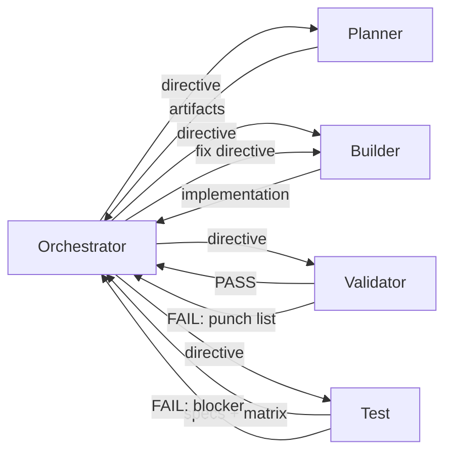

# Agents Index

> **Version 1.3.0** | Last updated: 2026-03-08

Quick-reference for the Orchestrator and developers to select the right agent and route work through the pipeline.

## Agents

| Agent | Role | Writes Code? | Skills |
|-------|------|:------------:|--------|
| **Orchestrator** | Coordinates loop, enforces gates, produces directives | No | 4 (archive-orchestration, create-adr, aims-gate-zero, human-approval-gate) |
| **Planner** | Produces _ORCH_PLAN / _ACCEPTANCE / _RISKS / _ARCHITECTURE_CONSTRAINTS / _TEST_MATRIX | No | 1 (adr-impact-review) |
| **Builder** | Implements assigned phase from the plan | Yes | 10 (see Bindings Summary) |
| **Validator** | Fresh-context audit + commands, punch list only | No | 2 (adr-compliance-review, pre-commit-checklist) |
| **Test** | Vitest specs + Playwright E2E when applicable + _TEST_MATRIX, no prod code except minimal hooks | Spec files only | 2 (vitest-angular-component-test, browser-e2e-flow) |

---

## Default Pipeline

Validator or Test failures route back through a **fresh Builder session** with the punch list / blocker. The Orchestrator never self-reviews or self-fixes.

When ADRs apply, the Planner also publishes `_ARCHITECTURE_CONSTRAINTS.md`, and the Validator must review against it before Gate 4 can pass.

---

## When to Skip

| Change Size | Example | Pipeline |
|-------------|---------|----------|
| **Small** (1-2 files, bug fix) | Typo, one-liner fix | Orchestrator > Builder > (optional Validator) |
| **Medium** (new component, 5-10 files) | Add a widget, new route | Full loop, single phase |
| **Large** (multi-phase, cross-cutting) | Major feature, refactor | Full loop, repeated per phase |

---

## Bindings Summary

| Agent | Rule Bindings | Skill Bindings |
|-------|---------------|----------------|
| Orchestrator | `orchestrator.mdc`, `adr-compliance.mdc`, `project-best-practices.mdc` | archive-orchestration, create-adr, aims-gate-zero, human-approval-gate |
| Planner | `planner.mdc`, `adr-compliance.mdc`, `project-best-practices.mdc` | adr-impact-review |
| Builder | `builder.mdc`, `adr-compliance.mdc`, `project-best-practices.mdc`, `error-handling-conventions.mdc`, `logging-conventions.mdc`, `security-sanitization.mdc`, `storage-conventions.mdc`, `feature-flag-conventions.mdc` | scaffold-angular-component, add-feature-route, add-rbac-guard, integrate-portal-api, i18n-add-strings, add-dashboard-widget, add-signal-store, add-feature-flag, add-error-page, pre-commit-checklist |
| Validator | `validator.mdc`, `adr-compliance.mdc`, `project-best-practices.mdc`, `error-handling-conventions.mdc`, `logging-conventions.mdc`, `security-sanitization.mdc`, `storage-conventions.mdc`, `feature-flag-conventions.mdc` | adr-compliance-review, pre-commit-checklist |
| Test | `test.mdc`, `adr-compliance.mdc`, `project-best-practices.mdc` | vitest-angular-component-test, browser-e2e-flow |

Always-apply vs glob-activated rules are defined in each `.mdc` file's frontmatter. See [`.cursor/rules/index.md`](../rules/index.md). This repository uses **`documentation-conventions`** for JSDoc and Svelte component docs (there is no separate `jsdoc-conventions` rule file). **`lint-and-code-quality`** applies when editing `src/**/*.ts` or `src/**/*.svelte`. **`orchestration-artifacts`** applies under `.cursor/orchestrations/**`.

---

## Version Alignment

- Keep each role's rule and agent definition aligned as a pair (`.cursor/rules/<role>.mdc` and `.cursor/agents/<role>.md`).
- When one side changes workflow semantics, required inputs, outputs, bindings, or gate behavior, review the counterpart in the same pass.
- If only one file needs a version bump, document the reason in `.cursor/CHANGELOG.md` so the mismatch is intentional rather than drift.

## Skill Versioning Policy

- **Patch**: typo fixes, wording clarifications, or metadata-only edits that do not change the procedure.
- **Minor**: additive procedure changes, new guardrails, updated examples, new references, or stronger validation steps.
- **Major**: breaking workflow changes that require callers or roles to change how they invoke the skill.

---

## Common Flows

- **Small bug fix**: Orchestrator > Builder > (optional Validator)
- **Medium feature**: Orchestrator > Planner > Builder > Validator > Test
- **Large multi-phase**: Orchestrator > Planner > (Builder > Validator > Test) x N phases
