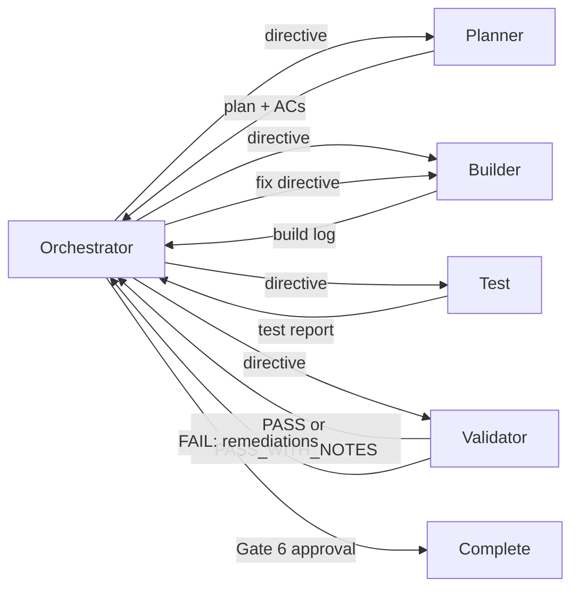

# Agents Index

> **Version 2.0.0** | Last updated: 2026-05-15

Quick reference for routing WFD work through the task-folder orchestration model. The detailed guide lives in [`docs/ORCHESTRATED_DEVELOPMENT.md`](../../docs/ORCHESTRATED_DEVELOPMENT.md).

## Agents

| Agent | Role | Writes code? | Owns artifacts |
| --- | --- | :---: | --- |
| **Orchestrator** | Coordinates the run, enforces gates, updates manifest state, issues directives, records human approval | No | `task-manifest.json`, optional `human-approval.md` |
| **Planner** | Converts objective into executable scope, interfaces, ADR implications, commands, and ACs | No | `plan.md`, `acceptance-criteria.md` |
| **Builder** | Implements exactly the planned scope and records implementation evidence | Yes | `build-log.md` |
| **Test** | Maps ACs to automated tests and records test evidence | Test files and harness only | `test-report.md` |
| **Validator** | Performs fresh-context audit after tests and writes verdict/remediations | No | `validation-report.md` |

## Default Pipeline

Validator `FAIL` routes through a fresh Builder session, then `Test`, then `Validator` again. The Orchestrator never self-reviews or self-fixes.

## Run State

Every run lives under `.cursor/orchestrations/{task-id}/`.

| File | Owner | Purpose |
| --- | --- | --- |
| `task-manifest.json` | Orchestrator | Source of truth for status, current agent, gates, loops, locks, sessions, approval |
| `plan.md` | Planner | Design truth, scope boundary, file map, interfaces, ADR implications |
| `acceptance-criteria.md` | Planner | Stable `AC-01` style criteria for Test and Validator |
| `build-log.md` | Builder | Files changed, command evidence, deviations, gaps |
| `test-report.md` | Test | AC-to-test map, uncovered criteria, stability notes, commands |
| `validation-report.md` | Validator | Verdict, evidence, ADR compliance, regressions, remediations |
| `human-approval.md` | Orchestrator | Gate 6 evidence summary and approval/rework record |

## Lifecycle Gates

| Gate | Name | Required for |
| --- | --- | --- |
| 0 | Intake and risk tier | Every run |
| 1 | Requirements freeze | Planned runs |
| 2 | Executable plan | Planned runs |
| 3 | Build complete | Every code-changing run |
| 4 | Tests mapped | Every code-changing run unless explicitly recorded as skipped for a small non-testable change |
| 5 | Validation green | Medium/large runs and small runs when not explicitly skipped |
| 6 | Human approval | Every code-changing run before `complete` |

## Right-Sized Flows

| Change size | Example | Pipeline |
| --- | --- | --- |
| **Small** | One-file copy fix, isolated doc tweak, low-risk UI polish | Orchestrator -> Builder -> Test or Validator as justified -> Orchestrator Gate 6 |
| **Medium** | New component, route behavior, local store change | Orchestrator -> Planner -> Builder -> Test -> Validator -> Orchestrator Gate 6 |
| **Large** | Multi-phase feature, sync/auth/AI/offline/security work, ADR-governed architecture | Orchestrator -> Planner -> (Builder -> Test -> Validator) x N -> Orchestrator Gate 6 |

Planner and Validator should not be skipped for durable architecture, Accepted ADR boundaries, local data ownership, offline behavior, auth/cloud sync, AI provider work, service worker changes, or security-sensitive changes.

## Binding References

| Area | Reference |
| --- | --- |
| Role contracts | `.cursor/agents/orchestrator.md`, `planner.md`, `builder.md`, `test.md`, `validator.md` |
| Artifact edit ownership | `.cursor/rules/orchestration-artifacts.mdc` |
| ADR authority | `adrs/INDEX.md`, `adrs/GOVERNANCE.md` |
| Project conventions | `.cursor/rules/project-best-practices.mdc`, `.cursor/rules/documentation-conventions.mdc`, `.cursor/rules/lint-and-code-quality.mdc` |
| Svelte workflow | `.cursor/rules/svelte-mcp-workflow.mdc`, `.cursor/rules/svelte-5-ui-conventions.mdc` |

There are no per-role `.cursor/rules/<role>.mdc` files in WFD. The role contracts in `.cursor/agents/*.md` plus the artifact rule are the local source of truth.

## Common Starts

- **Full feature:** Start with Orchestrator, classify tier, create manifest, route Planner.
- **Targeted resume:** Start with Orchestrator, adopt task folder, inspect manifest and artifacts, route the next required role.
- **Validation failure:** Orchestrator reads `validation-report.md`, increments `loop_count` when allowed, routes Builder with Required remediations, then Test and Validator.
- **Human rework request:** Orchestrator records `rework_history`, increments `rework_count`, clears stale completion approval fields, and routes Builder unless scope changed enough to require Planner.
