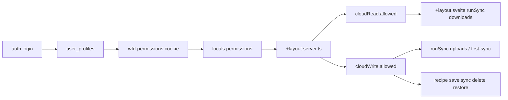

# Deprecate `cloud_storage` for `read_cloud` / `write_cloud`

## Objective

Done looks like: no application runtime path reads or writes `cloud_storage`; session permissions and UI gates use `read_cloud` / `write_cloud`; recipe mutate/sync-up requires `write_cloud`; layout sync can download when only `read_cloud` is true (demo account).

## Chosen contracts (do not re-decide)

**Cookie / `PermissionFlags` / `locals.permissions` / `permissionFlags`:**

```ts
{
  ai_assistance: boolean;
  read_cloud: boolean;
  write_cloud: boolean;
}
```

**Layout `permissions` PageData** (replace singular `cloudSync`):

```ts
{
  cloudRead: PolicyResult; // from read_cloud
  cloudWrite: PolicyResult; // from write_cloud
  aiAssistedRecipe: PolicyResult;
}
```

**Semantics (product assumption, not DB-enforced):** any context that needs `write_cloud === true` also has `read_cloud === true`. Demo: `read_cloud === true`, `write_cloud === false`.

**Mapping rule for call sites:**

| Need                                                                                | Flag                                 |
| ----------------------------------------------------------------------------------- | ------------------------------------ |
| List/download/view remote recipes; pull into Dexie                                  | `read_cloud` / `cloudRead.allowed`   |
| Upload, update, soft-delete sync, restore, purge, share create, conflict **upload** | `write_cloud` / `cloudWrite.allowed` |

All current `hasCloudStorageAccess` / `cloudSync.allowed` recipe-page usages are **write** → switch to `cloudWrite.allowed` and rename locals to `hasCloudWriteAccess`.

## Scope

**In scope**

- Schema, types, cookie helpers, login caching, layout load, UI gates, layout sync permission gating, tests, READMEs that name `cloud_storage`, GAP doc strings that cite the old flag, ADR-011 prose that names `cloud_storage`.

**Out of scope**

- Provisioning the demo Supabase user/row
- SQL migrations / dropping the `cloud_storage` column (columns already exist outside this repo)
- New “browse cloud without Dexie” UI surface (demo uses existing download-only sync into local Dexie)
- Server-side enforcement inside `CloudService` methods (still document that callers must check flags; RLS remains remote authority)
- Full `deriveCloudCapability` parity with every GAP-010 remediation item beyond what’s needed for this rename

## Risk and phase strategy

**Risk tier:** medium (auth/cloud permissions + sync behavior).

**Cookie note:** Old `wfd-permissions` cookies that only contain `cloud_storage` will fail the updated type guard and yield `permissions: null` until the user signs in again. That is acceptable; do not silently map `cloud_storage` → both new flags.

---

## Phase 1 — Schema and permission plumbing

**Deliverables:** Profile schema + cookie + login + layout types use the new flags; `cloud_storage` no longer required for app gating.

**Files**

- [`src/lib/api/account/account.schemas.ts`](src/lib/api/account/account.schemas.ts) — Make `read_cloud` and `write_cloud` required `z.boolean()` (same style as `ai_assistance`). Keep `cloud_storage` only as **optional/nullable + `@deprecated`** so rows that still return the column parse, but app code must not read it (same pattern as legacy `preferences` jsonb).
- [`src/lib/api/account/account.model.ts`](src/lib/api/account/account.model.ts) — `ProfilePermissionFlag = 'ai_assistance' | 'read_cloud' | 'write_cloud'`.
- [`src/lib/api/auth/auth.types.ts`](src/lib/api/auth/auth.types.ts) — Update `PermissionFlags`.
- [`src/lib/api/auth/auth.permissions.ts`](src/lib/api/auth/auth.permissions.ts) — `isPermissionFlags` requires both cloud booleans; update JSDoc.
- [`src/routes/auth/+page.server.ts`](src/routes/auth/+page.server.ts) — Cache `hasPermission(profile, 'read_cloud'|'write_cloud')` (stop using `cloud_storage`).
- [`src/app.d.ts`](src/app.d.ts) — Locals + `permissionFlags` + `permissions` PageData shapes.
- [`src/routes/+layout.server.ts`](src/routes/+layout.server.ts) — Map to `cloudRead` / `cloudWrite`.
- [`src/lib/types/auth.ts`](src/lib/types/auth.ts) — Update deprecated `PolicyName` union.
- Tests: [`account.model.test.ts`](src/lib/api/account/account.model.test.ts), [`auth.permissions.test.ts`](src/lib/api/auth/auth.permissions.test.ts); fixture in [`page.svelte.test.ts`](src/routes/page.svelte.test.ts).

**Exit:** `pnpm run check` types clean for these modules; unit tests for `hasPermission` / cookie parse updated and passing.

---

## Phase 2 — UI write gates + layout sync read/write behavior

**Deliverables:** Recipe surfaces gate mutations on `cloudWrite`; layout sync respects read vs write so demo can download without uploading.

**Files / behavior**

- Rename and rewire in:
  - [`src/routes/recipes/[...id]/+page.svelte`](src/routes/recipes/[...id]/+page.svelte)
  - [`src/routes/recipes/[...id]/edit/+page.svelte`](src/routes/recipes/[...id]/edit/+page.svelte)
  - [`src/routes/recipes/new/+page.svelte`](src/routes/recipes/new/+page.svelte)
  - [`src/routes/recipes/trash/+page.svelte`](src/routes/recipes/trash/+page.svelte)
  - [`src/routes/suggestions/recipe/+page.svelte`](src/routes/suggestions/recipe/+page.svelte)

  Pattern:

  ```ts
  let hasCloudWriteAccess = $derived(
    data.permissions?.cloudWrite.allowed ?? false
  );
  ```

- [`src/routes/+layout.svelte`](src/routes/+layout.svelte) — **Required behavioral fix** (today `runSync` ignores entitlements):
  1. Derive `canReadCloud` / `canWriteCloud` from `data.permissions`.
  2. At start of `runSync`: return early unless `canReadCloud || canWriteCloud` (and still require online).
  3. Never call `performUpload`, `handleFirstSyncConfirm` upload, or conflict `action === 'upload'` unless `canWriteCloud`.
  4. Read-only path: allow `download-only` and download sides of `syncNonConflicts` / conflict resolve; for `first-sync` (local recipes, empty cloud) do **not** open upload confirmation — complete as no-op or informational (no cloud write).
  5. Conflict UI: disable/hide “Upload to cloud” when `!canWriteCloud`; still allow download resolve when `canReadCloud`.
  6. Auto-resolve: skip items whose `action === 'upload'` when `!canWriteCloud` (prefer download-only auto actions or leave unresolved without mutating cloud).

- Docs/comments only (no new server gates):
  - [`src/lib/api/cloud/cloud.service.ts`](src/lib/api/cloud/cloud.service.ts) example/JSDoc → `read_cloud` / `write_cloud`
  - [`src/lib/api/recipe/recipe.schemas.ts`](src/lib/api/recipe/recipe.schemas.ts) archived-field comment
  - [`src/routes/auth/README.md`](src/routes/auth/README.md), [`src/lib/api/account/README.md`](src/lib/api/account/README.md), [`src/lib/api/README.md`](src/lib/api/README.md)
  - [`docs/readme-adr-alignment-gaps.md`](docs/readme-adr-alignment-gaps.md) permission-flag table + remediation item 4 (`session + read_cloud/write_cloud`)
  - [`adrs/ADR-011-self-hosting-provider-model.md`](adrs/ADR-011-self-hosting-provider-model.md) §4 / enforcement bullets: replace `cloud_storage` with `read_cloud`/`write_cloud` (WFD-managed entitlements). Do **not** change Accepted ADR status.

**Optional small helper (recommended in this phase):** add `deriveCloudCapability` next to [`deriveAICapability`](src/lib/api/auth/auth.capability.ts) returning `{ canReadCloud, canWriteCloud, reason }` from session + `cloudRead`/`cloudWrite` + online; use it from `+layout.svelte` so gating is not ad hoc. Keep scope to this helper + layout usage (do not refactor every recipe page onto it unless trivial).

**Svelte MCP:** After editing `.svelte` files, run `list-sections` → relevant `get-documentation` → `svelte-autofixer` per project rules.

**Exit:** `pnpm run format && pnpm run lint && pnpm run check && pnpm run test && pnpm run build`.

---

## Capability matrix (state for ADR-001 / offline-first)

| Actor                                                  | Online                                                                                 | Offline                                       |
| ------------------------------------------------------ | -------------------------------------------------------------------------------------- | --------------------------------------------- |
| Anonymous / logged out                                 | Local recipe book only; no cloud sync                                                  | Same                                          |
| Signed-in, `read_cloud=false`, `write_cloud=false`     | No layout sync; recipe pages Dexie-only                                                | Dexie-only                                    |
| Signed-in demo: `read_cloud=true`, `write_cloud=false` | Layout can **download** cloud recipes into Dexie; no uploads/deletes/restores to cloud | Local Dexie (including previously downloaded) |
| Signed-in full: both true                              | Bidirectional sync + recipe write sync                                                 | Local Dexie; sync deferred until online       |

Missing write permission must **not** block local save/edit/search (ADR-004).

---

## Interface contracts (Builder checklist)

```ts
// account.schemas — required new columns
read_cloud: z.boolean();
write_cloud: z.boolean();
cloud_storage: z.boolean().optional().nullable(); // deprecated; unused by app

// login cookie
setSessionPermissions(cookies, {
  ai_assistance: hasPermission(profile, 'ai_assistance'),
  read_cloud: hasPermission(profile, 'read_cloud'),
  write_cloud: hasPermission(profile, 'write_cloud')
});

// +layout.server.ts
cloudRead: {
  allowed: permissionFlags?.read_cloud ?? false;
}
cloudWrite: {
  allowed: permissionFlags?.write_cloud ?? false;
}
```



## ADR implications

- **ADR-004:** Cloud remains optional enhancement; split flags refine gating; local recipe book must stay usable without write.
- **ADR-005:** Sync semantics unchanged; only **when** upload vs download is allowed changes.
- **ADR-001 / offline-first:** Demo pull requires online + `read_cloud`; offline uses Dexie after download.
- **ADR-008:** Zod remains SoT for profile row; deprecate legacy column in schema docs.
- **ADR-011:** Update naming so self-host vs WFD-managed entitlement prose cites `read_cloud`/`write_cloud`.
- **ADR-016:** Keep layout/data permissions as load-sourced gates; no new TanStack ownership for flags.

## Validation commands

```bash
pnpm run format
pnpm run lint
pnpm run check
pnpm run test
pnpm run build
```

Manual smoke (Builder or Tester): sign-in as a profile with `read_cloud=true` / `write_cloud=false` → empty local DB → layout download-only sync populates recipes → save/delete/sync-up UI does not mutate cloud.

## Risks

| Risk                                              | Mitigation                                                                       |
| ------------------------------------------------- | -------------------------------------------------------------------------------- |
| Stale cookies after deploy                        | Document re-login; type guard rejects old shape                                  |
| Layout still uploads for demo                     | Explicit `canWriteCloud` guards on every upload path                             |
| Profile parse fails if DB still omits new columns | Confirm columns exist (user stated they do); required Zod will surface misconfig |
| Conflict auto-resolve uploads despite read-only   | Filter upload actions when `!canWriteCloud`                                      |

## Rollback

Revert the branch; users with new cookies may need one re-login if rolled back to `cloud_storage`-only guard.

## Open questions

None blocking — PageData shape and semantics are fixed above. Supabase column drop of `cloud_storage` is a separate ops task.
