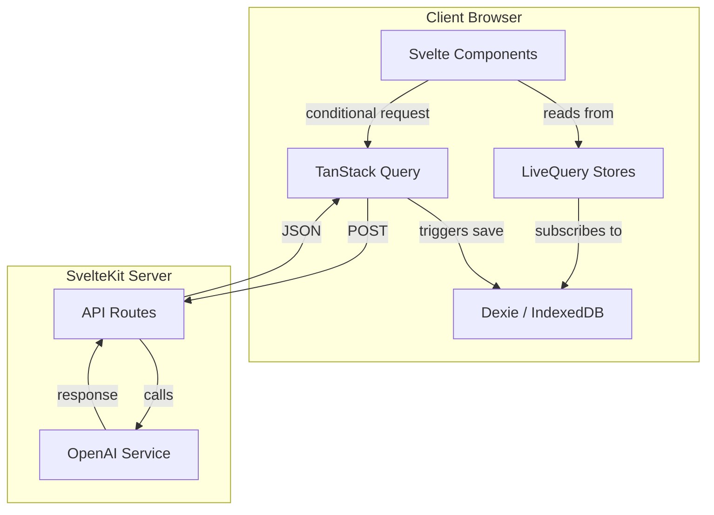
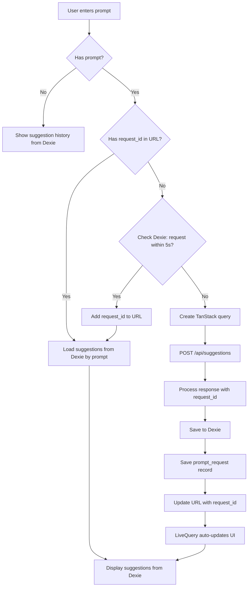
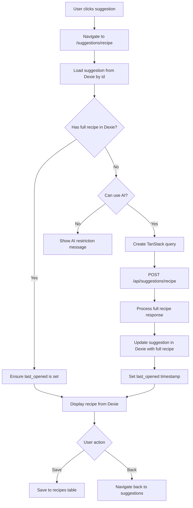

# Suggestions System Architecture

This document describes the architecture of the AI-powered recipe suggestions system in "What's For Dinner." The system is designed with a **Dexie-first approach** to prevent duplicate OpenAI API requests, enable offline functionality, and provide instant UI updates from cached data.

## Overview

The suggestions system allows users to:

1. Request recipe suggestions based on a text prompt (e.g., "quick pasta dishes")
2. View suggestions saved from previous requests
3. Click a suggestion to generate and view the full recipe
4. Save full recipes to their personal recipe book

All data flows through IndexedDB (via Dexie) as the source of truth for UI display.

## Key Design Principles

1. **Dexie-First Display**: All UI components read from Dexie via LiveQuery stores, never directly from API responses
2. **Request Deduplication**: Prompts are tracked to prevent duplicate API calls
3. **Throttling**: Requests for the same prompt within 5 seconds use cached data
4. **Offline Support**: Previously fetched data is available without network connectivity
5. **Deterministic IDs**: Suggestion IDs are generated from prompt + title for consistency

## Architecture Diagram



## Database Schema

### Tables (Dexie v3)

```typescript
// Suggestions table - stores recipe suggestions
suggestions: 'id, created_at, last_opened, recipe_id';

// Prompt requests table - tracks API requests for deduplication
prompt_requests: 'request_id, prompt, created_at';

// Recipes table - stores saved full recipes
recipes: 'id, title, created_at, deleted_at, last_opened, owner_id, shared_id, synced, last_synced_at';
```

### Types

```typescript
type PromptRequest = {
  request_id: number; // Date.now() timestamp
  prompt: string; // Sanitized prompt string
  created_at: string; // ISO datetime
  suggestion_ids: string[]; // Array of suggestion ids
};

type Suggestion = RecipeSummary &
  Partial<FullRecipe> & {
    id: string; // UUID primary key
    recipe_id: string | null; // Link to saved recipe (recipes.id) when saved
    created_at: string; // ISO datetime
    last_opened?: string; // ISO datetime when full recipe was viewed
  };
```

## Request Flow Diagrams

### Suggestions Request Flow



### Full Recipe Request Flow



## Key Components

### Store Functions (`src/lib/stores/suggestions.ts`)

| Function                                            | Description                                        |
| --------------------------------------------------- | -------------------------------------------------- |
| `getPromptRequest(prompt)`                          | Get most recent prompt request from Dexie          |
| `getPromptRequestWithThrottle(prompt, ms)`          | Get request if within time threshold               |
| `savePromptRequest(requestId, prompt, suggestions)` | Save request metadata with suggestion IDs          |
| `suggestionsByPromptStore(prompt)`                  | Create LiveQuery store for prompt's suggestions    |
| `getSuggestionsForPrompt(prompt)`                   | One-time fetch of suggestions for prompt           |
| `saveSuggestions(suggestions)`                      | Bulk save suggestions with deduplication           |
| `suggestionStoreById(id)`                           | LiveQuery store for single suggestion              |
| `suggestionHistory`                                 | LiveQuery store for all suggestions (history view) |

### API Routes

| Endpoint                       | Description                                   |
| ------------------------------ | --------------------------------------------- |
| `POST /api/suggestions`        | Generate recipe suggestions from prompt       |
| `POST /api/suggestions/recipe` | Generate full recipe from title + description |

Both endpoints add a `request_id` (Date.now()) to responses for tracking.

## Deduplication Strategy

### How It Works

1. **URL-Based Tracking**: After a successful API call, the `request_id` is added to the URL as a search parameter
2. **Dexie Lookup**: When a prompt is entered, we first check Dexie for existing requests
3. **Throttle Window**: If a request for the same prompt exists within 5 seconds, we skip the API call
4. **Stable identifiers**: Suggestions use a standard UUID `id` primary key

### Example Flow

```
1. User enters "quick pasta dishes" (first time)
   → No existing request in Dexie
   → Make API call
   → Save request_id: 1704393600000
   → Update URL: ?prompt=quick+pasta+dishes&request_id=1704393600000

2. User navigates away and returns within 5 seconds
   → URL has request_id
   → Skip Dexie throttle check
   → Load directly from Dexie

3. User enters same prompt 10 seconds later
   → Check Dexie: found request_id 1704393600000 (age: 10s > 5s threshold)
   → Make new API call
   → Save new request_id: 1704393610000
   → Update URL
```

## Viewed Status

A suggestion is marked as "viewed" when:

1. The user navigates to the full recipe page
2. The full recipe is generated (or loaded from cache)
3. The `last_opened` timestamp is set on the suggestion record

This allows the UI to show a "Viewed" badge and prevents re-requesting recipes that have already been fully generated.

## Error Handling

| Scenario             | Behavior                                          |
| -------------------- | ------------------------------------------------- |
| API error            | Show error message, maintain existing cached data |
| Offline              | Show restriction message, display cached history  |
| Suggestion not found | Show error, suggest returning to suggestions list |
| Save failure         | Log error, continue showing recipe from memory    |

## Performance Considerations

1. **LiveQuery Efficiency**: Dexie's LiveQuery only triggers updates when relevant data changes
2. **Conditional Queries**: TanStack queries are only created when needed (`enabled` based on Dexie state)
3. **Bulk Operations**: Suggestions are saved using `bulkPut` for efficiency
4. **Pruning**: Old suggestions beyond 100 items are automatically removed

## Migration Notes

When upgrading from Dexie v1 to v2:

- The `prompt_requests` table is created automatically
- Existing suggestions remain unchanged
- Old suggestions won't have `request_id` linkage (acceptable for migration)
- No data migration required; new requests will be tracked going forward
