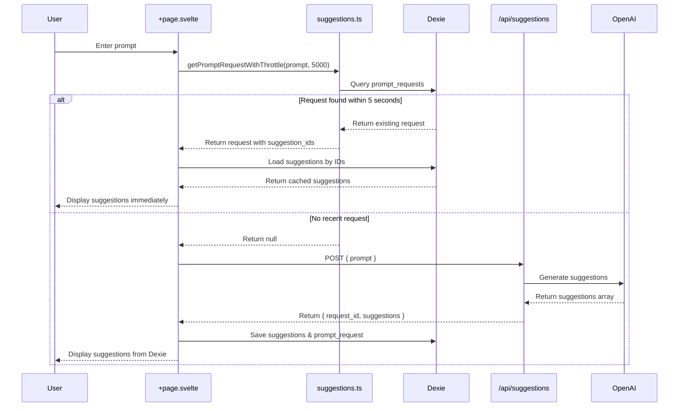
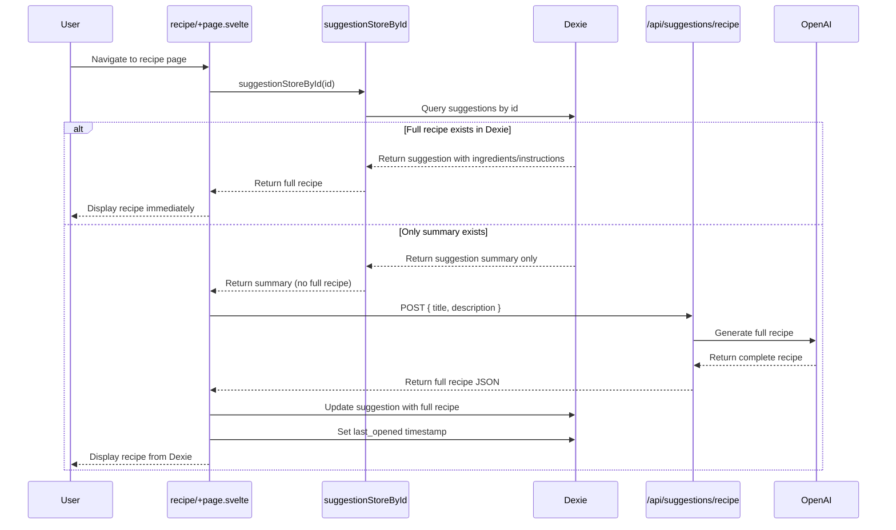
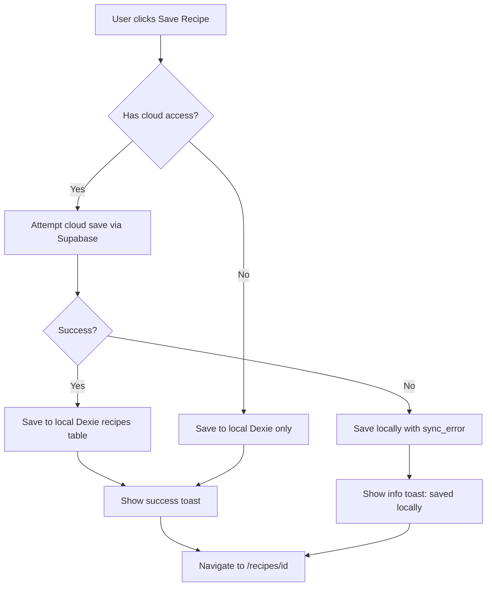
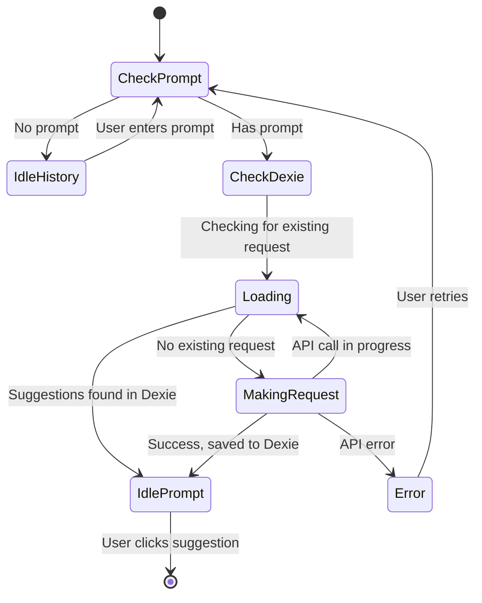
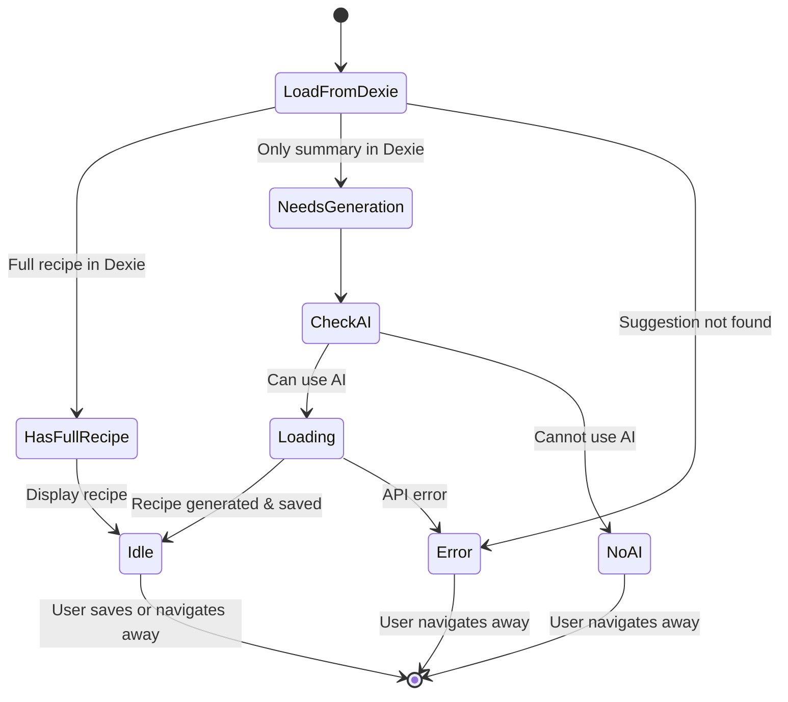

# Suggestions User Flow

This document describes the step-by-step user flows for the recipe suggestions feature in "What's For Dinner."

## Table of Contents

1. [Requesting New Suggestions](#requesting-new-suggestions)
2. [Viewing Suggestion History](#viewing-suggestion-history)
3. [Viewing a Full Recipe](#viewing-a-full-recipe)
4. [Saving a Recipe](#saving-a-recipe)
5. [Offline Behavior](#offline-behavior)

---

## Requesting New Suggestions

### User Journey

```
Home → Enter prompt → Submit → View suggestions → Click suggestion → View full recipe
```

### Detailed Steps

#### Step 1: User Enters a Prompt

The user navigates to the suggestions page and enters a text prompt describing what they want to eat.

**Example:** "quick pasta dishes for weeknight dinner"

#### Step 2: System Checks for Existing Request

Before making an API call, the system performs the following checks:



#### Step 3: Display Suggestions

Suggestions are always displayed from Dexie via a LiveQuery subscription:

```typescript
// LiveQuery store - automatically updates when Dexie changes
let promptSuggestionsStore = $derived.by(() => suggestionsByPromptStore(sanitizedPrompt));

// Subscribe to get reactive updates
let promptSuggestionsResult = $derived($promptSuggestionsStore);
let suggestionsFromDexie = $derived(promptSuggestionsResult?.data ?? []);
```

#### Step 4: URL Updated

After suggestions are loaded, the URL is updated to include the `request_id`:

```
/suggestions?prompt=quick+pasta+dishes
  ↓
/suggestions?prompt=quick+pasta+dishes&request_id=1704393600000
```

This enables:

- Direct linking to suggestion results
- Faster reload (skips Dexie throttle check)
- Debugging and tracking

---

## Viewing Suggestion History

### User Journey

```
Navigate to /suggestions (no prompt) → View all saved suggestions → Search/filter → Click to view recipe
```

### How It Works

When no `prompt` parameter is in the URL, the suggestions page shows the full history:

```typescript
// History view uses the suggestionHistory store
let filteredSuggestions = $derived.by(() => {
  if (!search || search.length <= 2) {
    return $suggestionHistory; // All suggestions, newest first
  } else {
    return filterSuggestions(search); // Filtered by search term
  }
});
```

### Features

- **Grouped by Date**: Suggestions are grouped by creation date
- **Search**: Filter suggestions by title or description
- **Delete**: Remove individual suggestions
- **Clear All**: Remove entire history
- **Viewed Badge**: Shows which suggestions have been opened

---

## Viewing a Full Recipe

### User Journey

```
Suggestions list → Click suggestion → Navigate to /suggestions/recipe → View/Save recipe
```

### Detailed Steps

#### Step 1: User Clicks a Suggestion

The system navigates to the recipe page with URL parameters:

```
/suggestions/recipe?id=abc-123&title=Garlic+Butter+Pasta&description=A+quick+weeknight+pasta
```

#### Step 2: Load from Dexie First



#### Step 3: Mark as Viewed

When a full recipe is generated or loaded, the `last_opened` timestamp is set:

```typescript
await db.suggestions.update(id, {
  ...fullRecipe,
  last_opened: new Date().toISOString()
});
```

This enables the "Viewed" badge to appear in the suggestions list.

---

## Saving a Recipe

### User Journey

```
View full recipe → Click "Save recipe" → Recipe saved to /recipes
```

### Save Flow



### Recipe Data Structure

When saved, the recipe is enriched with metadata:

```typescript
function createSavedRecipe(recipe: FullRecipe): SavedRecipe {
  const now = new Date().toISOString();
  return {
    ...recipe,
    id: crypto.randomUUID(),
    created_at: now,
    updated_at: now,
    last_opened: now,
    version: 1,
    is_current: true,
    is_favorite: false,
    synced: false
    // ... other metadata
  };
}
```

---

## Offline Behavior

### What Works Offline

| Feature                        | Offline Behavior                           |
| ------------------------------ | ------------------------------------------ |
| View suggestion history        | Full access to all cached suggestions      |
| View previously loaded recipes | Full access if recipe was generated before |
| Search history                 | Works on cached data                       |
| Delete suggestions             | Works, syncs later                         |

### What Requires Network

| Feature                   | Offline Behavior          |
| ------------------------- | ------------------------- |
| Request new suggestions   | Shows restriction message |
| Generate new full recipes | Shows restriction message |
| Cloud sync                | Queued for later          |

### Detection

The system uses a network store to track connectivity:

```typescript
let network = $derived($networkStore);
let aiCapability = $derived(
  deriveAICapability({
    session: data.session,
    permissions: data.permissions,
    featureFlags: data.featureFlags,
    online: network.online // Key offline detection
  })
);
```

When offline, the appropriate restriction message is shown:

```
"You are offline. Reconnect to request new recipe ideas."
```

---

## State Diagram

### Suggestions Page States



### Recipe Page States



---

## Data Examples

### Suggestion Record (Summary Only)

```json
{
  "id": "a1b2c3d4-e5f6-7890-abcd-ef1234567890",
  "title": "Garlic Butter Pasta",
  "short_description": "A quick weeknight pasta with garlic butter sauce",
  "created_at": "2024-01-04T12:00:00.000Z",
  "last_opened": null
}
```

### Suggestion Record (With Full Recipe)

```json
{
  "id": "a1b2c3d4-e5f6-7890-abcd-ef1234567890",
  "recipe_id": null,
  "title": "Garlic Butter Pasta",
  "short_description": "A quick weeknight pasta with garlic butter sauce",
  "description": "A rich, flavorful pasta perfect for busy evenings...",
  "ingredients": "- 1 lb spaghetti\n- 4 tbsp butter\n- 6 cloves garlic...",
  "instructions": "1. Bring a large pot of salted water to boil...",
  "tags": ["pasta", "quick", "weeknight", "italian"],
  "yield": "Serves 4",
  "prep_time": ["5", "10"],
  "cook_time": ["15", "20"],
  "notes": null,
  "created_at": "2024-01-04T12:00:00.000Z",
  "last_opened": "2024-01-04T12:05:00.000Z"
}
```

### Prompt Request Record

```json
{
  "request_id": 1704369600000,
  "prompt": "quick pasta dishes",
  "created_at": "2024-01-04T12:00:00.000Z",
  "suggestion_ids": ["a1b2c3d4-e5f6-7890-abcd-ef1234567890", "b2c3d4e5-f6a7-8901-bcde-f12345678901", "c3d4e5f6-a7b8-9012-cdef-123456789012"]
}
```
